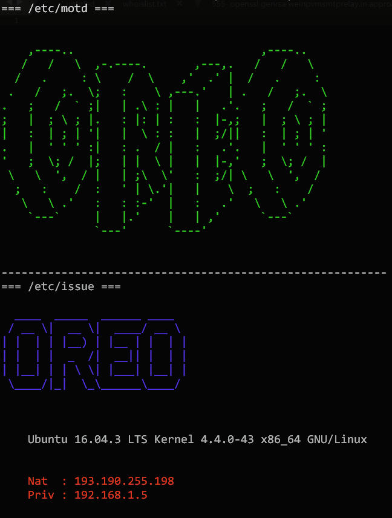

INTRODUCTION
============

FancyPrompt will help you customizing your prompt (local shell and ssh) with some great ascii arts and useful info.
It works with templates, so, feel free to adjust the templates to your needs.

PREVIEW
=======



PREQUISITE
==========

Install figlet

```
sudo apt install figlet
```

or

```
sudo yum install figlet
```

USAGE
=====

./fancyprompt.bash


INSTALLATION
============

The generated files must be inserted in /etc.
Please note /etc/issue uses special command to dynamically add informations.
The preview will show you the specific command but will not replace them as seen after a SSH.
See below for syntax help.

Information on network interface should be adapted to your needs.


SYNTAX FOR /etc/issue
=====================

| switch | Description |
| -------| ---------------------------------------------------------------------------------------- |
| \b | Insert the baudrate of the current line. |
| \d | Insert the current date. |
| \s | Insert the system name, the name of the operating system. |
| \l | Insert the name of the current tty line. |
| \m | Insert the architecture identifier of the machine, e.g., i686. |
| \n | Insert the nodename of the machine, also known as the hostname. |
| \o | Insert the domainname of the machine. |
| \r | Insert the release number of the kernel, e.g., 2.6.11.12. |
| \t | Insert the current time. |
| \u | Insert the number of current users logged in. |
| \U | Insert the string "1 user" or "<n> users" where <n> is the number of current users logged in. |
| \v | Insert the version of the OS, e.g., the build-date etc. |

LICENCE
=======

MIT.
